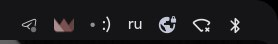

# Smiley bar widget

A tiny `:)` in the status bar — a minimal example module for the
[illogical-impulse-plugins](https://github.com/Rom4ik-12/illogical-impulse-plugins) module system.



## Install

### Via the Modules settings page

1. Open **Settings → Modules → Install module**
2. Paste the URL and click **Install**:
   ```
   https://github.com/Rom4ik-12/smiley-bar-widget/releases/latest/download/smiley-bar-widget.qsmod
   ```
3. Enable the module in the **Installed** list.

### Manual

```sh
cd ~/.config/illogical-impulse/user_modules
curl -LO https://github.com/Rom4ik-12/smiley-bar-widget/releases/latest/download/smiley-bar-widget.qsmod
unzip smiley-bar-widget.qsmod -d smiley-bar-widget
```

Then enable it in **Settings → Modules**.

## Customise

Edit `Smiley.qml` — anything you put as the root element lands in the bar slot:

```qml
StyledText {
    text: ":)"
    font.pixelSize: Appearance.font.pixelSize.normal
    color: Appearance.colors.colOnLayer0
}
```

Replace the text with a `MaterialSymbol`, an `Image`, or any QtQuick item.

## Requirements

- [illogical-impulse-plugins](https://github.com/Rom4ik-12/illogical-impulse-plugins) installed
- quickshell with illogical-impulse config
